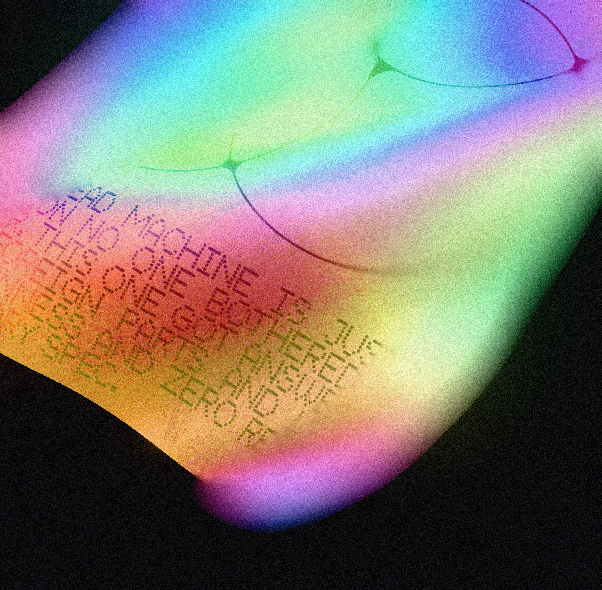

# Iris

A browser toy for playing with holographic fabric — a sheet of simulated cloth floating in space that you can grab, throw, drape your own images over, and watch ripple like it's printed on holo foil. Named for Iris, the Greek goddess of the rainbow.



## What it does

- **Real cloth physics** — grab the sheet and pull. It wrinkles, settles, and floats like fabric in gel. Verlet integration, no physics library.
- **Holographic material** — an iridescent foil shader with rainbow diffraction, sparkle, and bump maps. Chrome and black cloth presets too.
- **Your images** — upload any image or SVG and it becomes the cloth, or a sticker on top of it. Everything bends and folds with the fabric.
- **Camera looks** — macro depth of field (click to pick a focus point), ambient occlusion in the folds, film grain, bloom.
- **Export** — one-click PNG, with or without the background.
- **Versions** — save looks and switch between them while you work.

## Controls

| Action | How |
|---|---|
| Grab the cloth | Click + drag on it |
| Orbit the camera | Drag empty space |
| Pan | Hold `Space` + drag, or right-drag |
| Zoom | Scroll |
| Move a sticker | Turn on `Edit` in the Images panel, then drag it |

## Run it

Needs Node 20+ and git:

```bash
git clone https://github.com/Mariaareadne1/iris-cloth.git && cd iris-cloth && npm install && npm run dev
```

Then open the local URL Vite prints — usually `http://localhost:5199`.

## Tech

- [Three.js](https://threejs.org) (WebGL 2) — rendering
- [React](https://react.dev) + TypeScript + [Vite](https://vite.dev)
- Custom GLSL: a holo foil shader, a circle-of-confusion depth-of-field pass, film grain
- Custom cloth simulation: Verlet integration with structural, shear, and bend constraints
- [DialKit](https://github.com/joshpuckett/dialkit) by [Josh Puckett](https://x.com/joshpuckett) — the control panel UI

## Credits

**Iris** is an adaptation, maintained by [Maria Showalter](https://github.com/Mariaareadne1), of the excellent open-source **[Holocloth](https://github.com/dmitrykurash/holocloth)** by [Dmitry Kurash](https://x.com/DmitryKurash), used and modified under the MIT License.

UI powered by [DialKit](https://github.com/joshpuckett/dialkit) — a lovely little library by [Josh Puckett](https://x.com/joshpuckett) for dialing in interface parameters.
